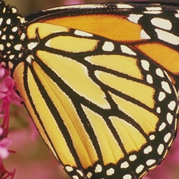
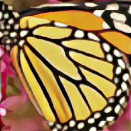
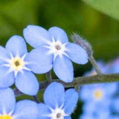
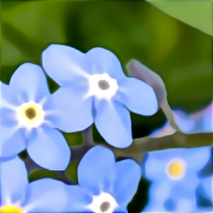

# torch vectorized KNN based Image Upscaler

## Overview

This is a hobby project that implements a simple edge-enhancement upscaler. It doesn't create new details (because it only uses the information that are already in the image) but rather tries to sharpen existing edges through patch matching. Results often have a "painted" look due to the limitations of the approach.

## Examples

### Comparison Set 1

<div style="display: flex; justify-content: space-between;">
  <div style="width: 32%;">
    
    <p align="center">Original</p>
  </div>
  <div style="width: 32%;">
    
    <p align="center">Bilinear Upscaling</p>
  </div>
  <div style="width: 32%;">
    
    <p align="center">KNN Upscaler</p>
  </div>
</div>

### Comparison Set 2

<div style="display: flex; justify-content: space-between;">
  <div style="width: 32%;">
    
    <p align="center">Original</p>
  </div>
  <div style="width: 32%;">
    
    <p align="center">Bilinear Upscaling</p>
  </div>
  <div style="width: 32%;">
    
    <p align="center">KNN Upscaler</p>
  </div>
</div>

## What it actually does

- Basic bilinear upscaling as a foundation
- Assumes self-similarity and uses the high frequency detail pixels of the not upscaled original image as weighted predictions based on patch similarity
- Applies some contrast enhancement
- Often creates artistic/painted-looking results rather than photorealistic ones

## Installation

```bash
conda env create -f environment.yml
```

## Usage

```bash
conda activate torch_knn_upscaler
python run_upscaling.py
```

## Parameters

The upscaler has many parameters you can tweak, though most values are essentially magic numbers found through trial and error:

| Parameter | Default | What it sort of does |
|-----------|---------|-------------|
| a | 7.55 | Normalizes patch comparison |
| b | 4.69 | Controls contrast in patch weights |
| c | 0.1 | Prevents division by zero |
| d | 1.46 | Detail intensity multiplier |
| e | 0.8 | Controls how aggressively edges are enhanced |
| r | 4 | How far to look for similar patches |
| t | 1 | Spacing between pixels in patches (dilation) |
| u | 7.898 | Another weighting factor |
| k | 7 | Blur kernel size for downscaled image |
| s | 1.1 | Blur strength for downscaled image |
| v | 10.0 | High-frequency enhancement strength |
| w | 30 | Blur kernel size for detail extraction |
| z | 0.268 | Blur strength for detail extraction |

## How It Works (simplified)

1. **Start with bilinear upscaling** to generate a high resolution blurry image
2. **Compare patches** in the bilinear upscaled version with a blurred version of the original image, calculate a weighting based on the difference and use the corresponding pixels from a high frequency unsharp mask of the original image (not bilinear upscaled) as a prediction for the high frequency details.
3. **Add the predicted high frequency detail** to the bilinear upscaled image

## License

This project is licensed under the MIT License - see the LICENSE file for details